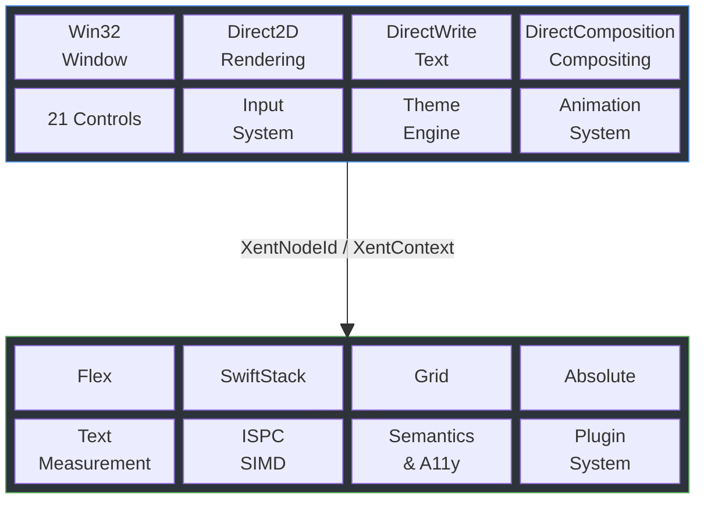
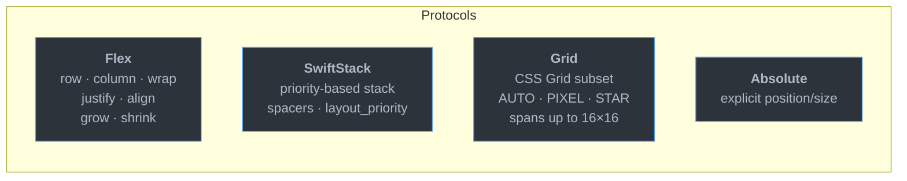
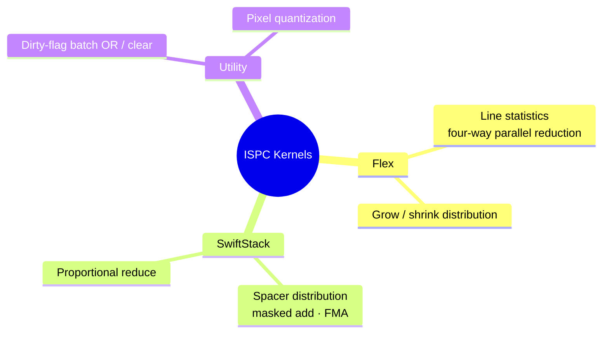
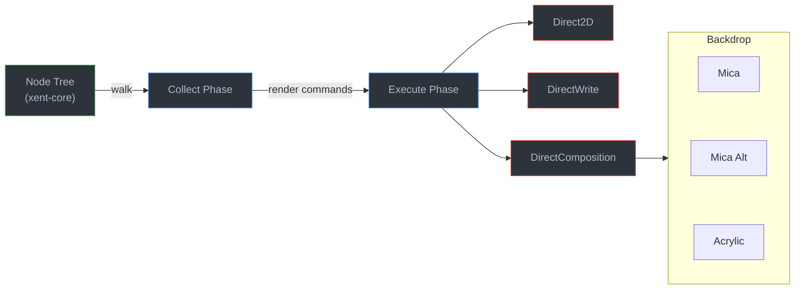

# Project Xent

**A pure-C UI layout engine — currently under active development.**

[](https://opensource.org/licenses/0BSD)
[](https://en.cppreference.com/w/c/11)
[](https://ispc.github.io/)

---

## Architecture

Project Xent is split into two repositories with a clear separation of concerns:

| | [xent-core](https://github.com/Project-Xent/xent-core) | [fluxent](https://github.com/Project-Xent/fluxent) |
|---|---|---|
| **Role** | Cross-platform layout engine | Windows Fluent Design UI framework |
| **Scope** | Node tree, layout, text measurement, semantics, SIMD | Rendering, controls, input, theming, animation |
| **Platform** | Any (no OS deps) | Windows 10/11 |
| **Rendering** | None | Direct2D · DirectWrite · DirectComposition |



---

## xent-core

> **Repository** — [github.com/Project-Xent/xent-core](https://github.com/Project-Xent/xent-core)
> · **Language** — C11
> · **Build** — xmake

### Layout Protocols



Incremental layout is supported via dirty-flag propagation (`DIRTY_SELF` · `DIRTY_SUBTREE` · `DIRTY_LAYOUT`). The engine skips clean subtrees on re-layout.

### Node Storage

Nodes are stored in a Structure-of-Arrays (`XentNodeStore`) for cache-friendly access. Fields cover tree topology, layout inputs/outputs, Flex and SwiftStack properties, Grid definitions, text attributes, accessibility semantics, and focus metadata (`focusable`, `tab_index`).

### SIMD Acceleration

ISPC kernels with runtime SSE4 / AVX2 dispatch accelerate:



### Text Subsystem

Pluggable `XentTextBackend` interface with a built-in **Mono** backend (zero external dependencies): word-wrap, char-wrap, multi-line measurement. Two-level cache: `XentTextCache` → `XentShapeCache`.

### Other Features

- **Accessibility** — semantic tree (`role`, `label`, `checked`, `value`, `enabled`, `expanded`, `selected`)
- **Focus management** — `focusable`, `tab_index`
- **Node tagging** — generic `uint8_t` per-node tag (`xent_set/get_node_tag`) for consumer-defined typing
- **Plugin system** — `xent_plugins.h`
- **CLI tooling** — JSON dump, demo scaffolding (`xent_cli.h`, opt-in include)
- **Profiling** — `xent_profile_get()` / `xent_profile_dump()`

### Public Headers

`xent.h` · `xent_types.h` · `xent_layout.h` · `xent_text.h` · `xent_plugins.h` · `xent_cli.h`

---

## fluxent

> **Repository** — [github.com/Project-Xent/fluxent](https://github.com/Project-Xent/fluxent)
> · **Language** — C17
> · **Platform** — Windows 10/11
> · **Build** — xmake

### Rendering Pipeline

Two-phase rendering: **collect** (walk xent-core node tree → build render command list) → **execute** (dispatch to per-control renderers).



### Control Library

fluxent defines the `XentControlType` enum (`flux_control_type.h`) — 27 control types that drive renderer dispatch, input routing, and factory creation. 21 of these have dedicated renderers:

<details>
<summary><b>21 rendered controls</b></summary>

| Control | Notes |
|---------|-------|
| **Button** | Standard / Subtle / Text / Accent styles |
| **ToggleButton** | Checked / unchecked state |
| **RepeatButton** | Initial delay + repeat interval |
| **Checkbox** | Three-state: Unchecked / Checked / Indeterminate |
| **RadioButton** | Mutually exclusive group selection |
| **ToggleSwitch** | Animated knob (normal / hover / press sizes) |
| **Slider** | Horizontal, animated thumb scaling |
| **TextBox** | Full editor: UTF-8/16, cursor, selection, multi-line, Undo/Redo (50 levels), IME, auto-scroll, right-click context menu |
| **PasswordBox** | TextBox core + `●` mask, press-to-reveal |
| **NumberBox** | min / max / step, SpinButtons: Inline / Compact / Hidden |
| **ProgressBar** | Determinate and indeterminate modes |
| **ProgressRing** | Circular progress indicator |
| **ScrollView** | H/V scroll, Auto / Always / Never scrollbar policy |
| **Card** | Container with background and shadow |
| **Divider** | Separator line |
| **HyperlinkButton** | Visited / unvisited color distinction |
| **InfoBadge** | Dot / Number / Icon variants |
| **Text** | Static multi-line with alignment and weight |
| **Flyout** | Transient content anchored to target, light-dismiss |
| **MenuFlyout** | Context menu with items, separators, nested submenus |
| **Tooltip** | Delayed hover info popup, auto-repositioning |

</details>

### Input System

- **Mouse** — hit testing, hover, click, double/triple click, scroll wheel
- **Keyboard** — full `WM_KEYDOWN` routing to focused node
- **IME** — `WM_IME_COMPOSITION` with cursor position feedback
- **Focus nav** — Tab / Arrow key ordered by `tab_index`

### Theme System

Light / Dark / System (reads Windows preference) with 39 Fluent semantic color tokens. Version-number cache so controls refresh only when the theme changes.

### Animation System

Frame-driven `FluxTween` (float) and `FluxColorTween` (RGBA), no external dependencies.

| Duration | Timing | Used for |
|----------|--------|----------|
| 83 ms | Fast | Checkbox check mark, slider thumb |
| 110 ms | Press | Press feedback |
| 167 ms | Normal | Hover / focus ring |
| 250 ms | Slow | Color transitions |

Easing: `ease_out_quad` · `ease_in_out_cubic`

---

## Building

Both repositories use [xmake](https://xmake.io).

```bash
git clone https://github.com/Project-Xent/xent-core.git
git clone https://github.com/Project-Xent/fluxent.git

cd fluxent
xmake
xmake run hello-fluxent
```

> [!TIP]
> On Windows, building with **MinGW (UCRT)** produces the smallest binaries.

> [!NOTE]
> ISPC must be available on `PATH` to compile the SIMD kernels in xent-core.
