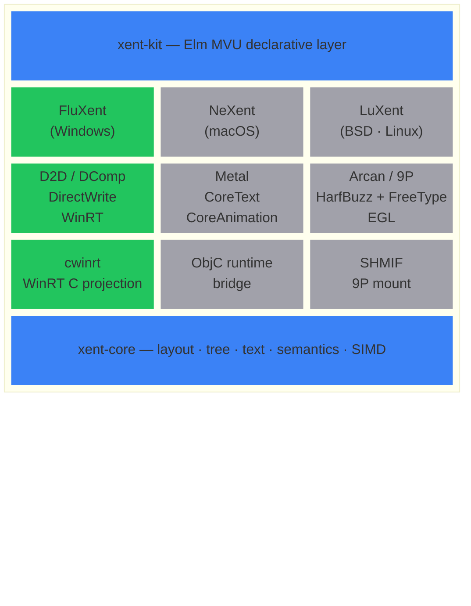

<picture>
  <source media="(prefers-color-scheme: dark)" srcset="https://img.shields.io/badge/Project_Xent-pure_C_desktop_UI-e2e8f0?style=for-the-badge&labelColor=0f172a">
  
</picture>


A desktop UI stack written entirely in C — layout engine, platform bindings,
Fluent Design controls, and a declarative Elm-architecture view layer — with
zero C++ and zero runtime dependencies beyond the OS.

```c
int main(void) {
    Model model = { .count = 0 };
    return flux_run(
        &(FluxAppConfig){ .title = L"Hello", .width = 640, .height = 480 },
        &model, update, view);
}
```

---

## Architecture



> [!NOTE]
> <b>Green</b> = shipped &nbsp; <b>Grey</b> = planned

`xent-core` and `xent-kit` are platform-agnostic and shared across every
target. Each platform provides its own rendering backend and system bindings;
xent-kit's reconciler diffs against whichever backend is underneath.

---

## Repositories

### [`xent-core`](https://github.com/Project-Xent/xent-core) &ensp;  

Platform-agnostic layout engine and node tree.

| | |
|---|---|
| **Layout protocols** | Flex (CSS Flexbox), Grid (WinUI Star/Auto/Pixel), SwiftStack (SwiftUI VStack/HStack semantics), Absolute |
| **Data layout** | Structure-of-Arrays — one contiguous float array per property, SIMD-friendly |
| **SIMD** | Optional ISPC backend (SSE4 + AVX2 multi-target dispatch) for hot layout paths |
| **Text** | Pluggable backend with measurement cache; built-in monospace fallback for headless use |
| **Correctness** | Yoga-ported conformance suite (13k lines), 19 unit-test targets, regression-gated benchmarks |
| **Accessibility** | Semantic roles, labels, checked/enabled/expanded states, focus + tab-index in the core tree |

<details>
<summary>Public API surface</summary>

```c
XentContext *xent_create_context(XentConfig const *config);
XentNodeId   xent_create_node(XentContext *ctx);
bool         xent_set_protocol(XentContext *ctx, XentNodeId node, XentProtocol protocol);
bool         xent_set_flex_direction(XentContext *ctx, XentNodeId node, XentFlexDirection dir);
bool         xent_set_stack_axis(XentContext *ctx, XentNodeId node, XentAxis axis);
bool         xent_layout(XentContext *ctx, XentNodeId root, float w, float h);
// … size, margin, padding, gap, min/max, percent, aspect-ratio, grid tracks,
//   direction (LTR/RTL), wrap-content, z-index, dirty flags, profiling …
```

</details>

---

### [`xent-kit`](https://github.com/Project-Xent/xent-kit) &ensp;  

Platform-agnostic declarative UI toolkit — Elm Architecture in C.

Each frame the app's `view` builds a throwaway element tree from arena memory;
the reconciler diffs it against the previous frame and patches retained controls.
Controls never call back directly — they post `XtkMsg` values consumed by `update`.

```c
XtkEl *view(XtkUi *ui, void *model) {
    Model *m = model;
    return xtk_column(ui, (XtkStackDesc){.gap = 12, .padding = {32,32,32,32}}, (XtkEl*[]){
        xtk_text(ui, "Counter", (XtkTextDesc){.size = 24}),
        xtk_text(ui, xtk_fmt(ui, "Count: %d", m->count), (XtkTextDesc){0}),
        xtk_button(ui, "Increment", (XtkButtonDesc){.on_click = xtk_msg(MSG_INC)}),
        m->count > 0
            ? xtk_button(ui, "Reset", (XtkButtonDesc){.on_click = xtk_msg(MSG_RESET)})
            : NULL,
    XTK_END});
}
```

> Compound literals + designated initializers make every property optional with
> a zero default. `NULL` entries are conditional rendering. The gallery demo —
> NavigationView, 21 control pages — is ≈ 1200 lines of view code.

| | |
|---|---|
| **Architecture** | Elm MVU — `Model` struct + pure `update(model, msg)` + pure `view(ui, model)` |
| **Element tree** | Double-buffered arena allocation; previous frame's tree stays alive for diffing, then the old arena resets |
| **Reconciler** | Keyed + positional child matching with reorder detection; `NULL` = conditional skip |
| **Backend** | 9-function `XtkBackend` vtable — `create`, `update`, `destroy`, `reorder`, `set_root`, `request_frame`, `show_popup`, `close_popup`, `set_cursor` |
| **Messages** | Tagged-union `XtkMsg` with `tag` + `value` (int or float); ring-buffer queue (256 entries) |
| **Controls** | Button · Checkbox · RadioButton · ToggleSwitch · Slider · ComboBox · DropDownButton · SplitButton · TextBox · PasswordBox · NumberBox · ProgressBar · ProgressRing · ScrollViewer · Card · InfoBadge · InfoBar · Divider · Expander · Hyperlink · RepeatButton · Image · NavigationView · TabView · ContentDialog · MenuFlyout · MenuBar · Tooltip |

<details>
<summary>Public API surface</summary>

```c
/* elements — each returns an arena-allocated XtkEl* */
XtkEl *xtk_button(XtkUi *ui, char const *label, XtkButtonDesc desc);
XtkEl *xtk_text(XtkUi *ui, char const *content, XtkTextDesc desc);
XtkEl *xtk_column(XtkUi *ui, XtkStackDesc desc, XtkEl *children[]);
XtkEl *xtk_row(XtkUi *ui, XtkStackDesc desc, XtkEl *children[]);
XtkEl *xtk_slider(XtkUi *ui, XtkSliderDesc desc);
XtkEl *xtk_nav_view(XtkUi *ui, XtkNavViewDesc desc, XtkEl *children[]);
XtkEl *xtk_tab_view(XtkUi *ui, XtkTabViewDesc desc, XtkEl *children[]);
XtkEl *xtk_content_dialog(XtkUi *ui, XtkContentDialogDesc desc, XtkEl *children[]);
// … checkbox, radio, toggle_switch, combo_box, card, expander, info_bar,
//   menu_bar, dropdown_button, split_button, image, hyperlink, tooltip …

/* modifiers — return the same element pointer for chaining */
XtkEl *xtk_keyed(XtkUi *ui, char const *key, XtkEl *el);
XtkEl *xtk_sized(XtkEl *el, float w, float h);
XtkEl *xtk_grow(XtkEl *el, float grow);

/* messages */
XtkMsg xtk_msg(int tag);
XtkMsg xtk_msg_i(int tag, int value);
XtkMsg xtk_msg_f(int tag, float value);

/* utilities */
char const  *xtk_fmt(XtkUi *ui, char const *fmt, ...);
XtkEl      **xtk_children_alloc(XtkUi *ui, int capacity);
```

</details>

---

### [`cwinrt`](https://github.com/Project-Xent/cwinrt) &ensp;   

Pure C projection for the entire Windows Runtime.

| | |
|---|---|
| **Generator** | Reads `.winmd` as PE + ECMA-335 `#~` metadata — no `cor.h`, no COM SDK headers |
| **Coverage** | 342 `Windows.*` namespaces; one header + one impl per namespace |
| **Runtime** | `init` · `hstring` (UTF-8/16) · `factory` (cached) · `async` (event + poll) · `delegate` · `event` — 951 lines total |
| **Naming** | [Frozen mangling spec](https://github.com/Project-Xent/cwinrt/blob/main/docs/MANGLING.md); overloads keyed by type signature, not ordinal — SDK additions never rename existing symbols |
| **CI gates** | Determinism (byte-stable) · Golden (ABI SHA-256) · PIID vs cppwinrt · Slot vs ABI · All-header compile · All-impl link · clang `-Werror` · MinGW full link × 4 arch · E2E on hardware |
| **Toolchains** | MSVC · clang-cl · clang · llvm-mingw |

<details>
<summary>C++/WinRT migration cheat sheet</summary>

| C++/WinRT | cwinrt |
|---|---|
| `winrt::init_apartment()` | `cwinrt_init(RO_INIT_MULTITHREADED)` |
| `Calendar c;` | `WGL_Calendar *c; wgl_calendar_new(&c);` |
| `c.Year()` | `int32_t y; wgl_calendar_get__year(c, &y);` |
| `obj.as<T>()` | `cwinrt_query(obj, &CWINRT_IID_T, &out)` |
| `co_await op;` | `cwinrt_async_wait((IUnknown *)op, INFINITE);` |
| `event += h;` | `on_event(self, fn, ctx)` → `cwinrt_token` |
| RAII release | `((IUnknown *)p)->lpVtbl->Release((IUnknown *)p)` |

</details>

---

### [`fluxent`](https://github.com/Project-Xent/fluxent) &ensp;  

WinUI 3-class Fluent Design backend for xent-kit, driven by xent-core layout
and cwinrt platform integration.

| | |
|---|---|
| **Render** | Direct2D / DirectWrite with snapshot diff + per-node cache; or Windows.UI.Composition retained tree with identity-stable visual reconciler, compositor-thread animations, and InteractionTracker scrolling |
| **Theming** | Live system accent + light/dark palettes using WinUI 3 design tokens; pixel-matched color values |
| **Input** | Hit testing · keyboard focus · DirectManipulation inertial scroll · InteractionTracker |
| **Accessibility** | Win32 UI Automation provider — control types, patterns, focus/invoke events |
| **Bridge** | Implements xent-kit's 9-function `XtkBackend` vtable; maps declarative element diffs to retained Fluent controls |
| **Dual API** | Declarative Elm path via xent-kit (`flux_run`), or imperative retained-mode path via `flux_create_*` for full node-level control |
| **Gallery** | Bundled WinUI Gallery-class demo app — NavigationView shell, 21 control pages, ≈ 1200 lines of pure view code |
| **Tests** | Headless reconciler lifecycle, keyed add/remove sequences, cross-axis geometry, CSS §9.4 grow+wrap regression, subtree destruction + leak detection — all GPU-free |

<details>
<summary>Gallery pages</summary>

Home · Button · Checkbox · RadioButton · ToggleSwitch · Slider · ComboBox ·
DropDownButton · SplitButton · RepeatButton · Hyperlink · TextBox ·
PasswordBox · NumberBox · Typography · ProgressBar · ProgressRing · InfoBadge ·
InfoBar · Image · Expander · Divider · Card · ScrollViewer · MenuBar ·
TabView · NavigationView · ContentDialog · Tooltip · Settings

</details>

---

## Platform roadmap

| Target | Backend | Binding layer | Status |
|:---|:---|:---|:---:|
| Windows 10+ | D2D · DirectWrite · DComp | cwinrt (WinRT C projection) | ✅ |
| macOS | Metal · CoreAnimation · CoreText | ObjC runtime bridge | 🔲 |
| OpenBSD | Arcan | SHMIF · 9P | 🔲 |
| FreeBSD | Arcan | SHMIF · 9P | 🔲 |
| musl Linux | Arcan | SHMIF · 9P | 🔲 |

The BSD and Linux stack targets [Arcan](https://arcan-fe.com) — a
single-protocol (`SHMIF`) display server with security-oriented composition —
and exposes UI resources over [9P](https://9p.cat-v.org) for Plan 9-style
composability and network transparency.

OpenBSD is the primary development platform for LuXent; its `pledge`/`unveil`
model and strict libc complement Arcan's design. Downstream porting follows
least-friction order: FreeBSD first, then musl-based Linux
([Chimera Linux](https://chimera-linux.org),
[Void Linux](https://voidlinux.org)).

---

## Build

All repositories use [xmake](https://xmake.io).

```bash
# xent-core
xmake && xmake test

# xent-kit
xmake && xmake test

# cwinrt (Windows, requires Windows SDK)
xmake build cwinrt-gen cwinrt-rt test_smoke
xmake run test_smoke

# fluxent gallery (Windows 10 1903+)
xmake run gallery

# fluxent hello demo (Windows 10 1903+)
xmake run hello_fluxent
```

---

<sub>Every repository under Project Xent is released under the [0BSD](https://opensource.org/license/0bsd) license.</sub>
